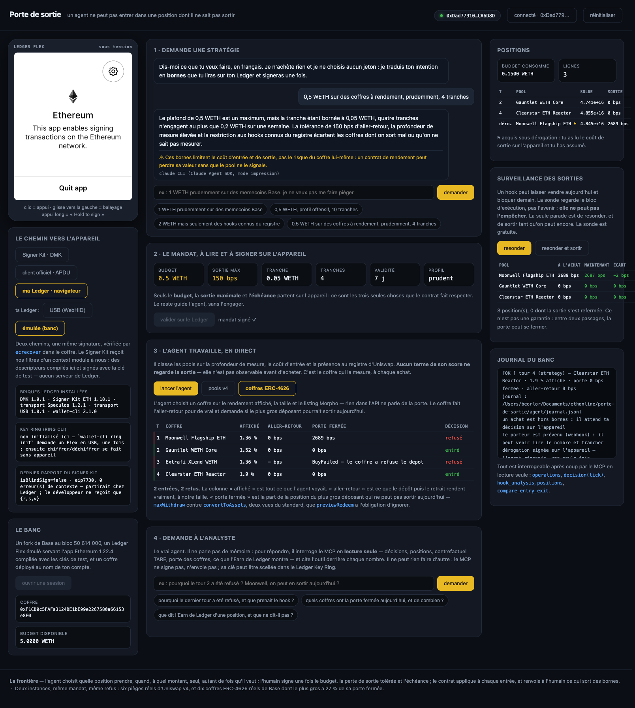

# PORTE DE SORTIE

> **Un agent ne peut pas entrer dans une position dont il ne sait pas sortir.**
>
> *Inside the mandate the agent acts on its own. It can never enter a position it cannot exit —
> the vault checks the way out in the same transaction. Anything else comes back to the Flex.*

**Vos Agent Policies bornent ce qu'un agent dépense. Personne ne borne ce qu'il peut ressortir.**

Tout le monde borne ce qu'un agent **engage** : un plafond par jour, une liste de contrats, un
glissement maximal. Personne ne vérifie ce qu'il pourra **récupérer**. Ça vaut pour un jeton qu'un hook
empêche de revendre, pour un coffre à rendement dont on ne sort qu'après sept jours de file d'attente,
et pour toute position qu'on prend en une transaction et qu'on quitte en trois semaines — ou jamais.

**L'instance démontrée ici est le swap Uniswap v4**, parce que c'est là qu'on sait prouver le nombre :
un Ledger Flex émulé, un mandat lu et signé **sur l'appareil**, et un coffre qui refuse d'entrer là
d'où on ne sort pas — sur un fork de Base épinglé au bloc **50 614 000**. Les coffres ERC-4626 sont la
**seconde instance, construite** : dix coffres WETH réels de Base (Morpho), sous le même mandat, avec le
même refus. Le standard y écrit le piège lui-même — `previewRedeem` doit ignorer les limites de retrait —
et au bloc des mesures le plus gros coffre WETH de Base a **27 % de la position de son plus gros
déposant bloquée**, pendant que cinq coffres sur dix refusent même le dépôt. Détail plus bas.

```bash
./scripts/demo.sh
```

---

## In English, on one page

**The sentence.** An agent cannot enter a position it does not know how to exit.

**The gap.** Everything today bounds what an agent *spends* — a daily cap, an allow-list, a maximum slippage;
Ledger's Agent Policies bound exactly that. Nothing bounds what it can *get back*. A token whose hook blocks
the resale, a yield vault with a seven-day exit queue: the same closed door, invisible at entry.

**The mechanism.** The holder signs **once**, on the Ledger, a mandate of three numbers read in clear on the
screen: budget, tolerated round-trip loss in basis points, expiry. A vault contract at the holder's address
(`ExitVault`) applies it at **every** entry: it buys, then simulates the full resale in the same transaction, and
refuses if the exit costs more than the mandate. For an ERC-4626 vault it performs the real deposit and
redemption, reverted, and reads the largest depositor's door. What overflows comes back to the device **with the
number**: the holder reads the real exit cost and signs a one-time exception — or leaves the refusal. If the exit
worsens before execution, the exception is void. The holder also funds the vault from the Ledger (one ETH transfer,
the only transaction it signs) and takes funds back through a clear-signed withdrawal authorisation.

**What is proven, on a Base fork pinned at block 50 614 000.** Six real Uniswap v4 traps, indistinguishable before
buying: 0 bps at entry, 9 990 bps at exit. Ten real Morpho WETH vaults under the same mandate: the largest has 27 %
of its biggest depositor's position locked, five refuse deposits outright. 38 Foundry tests, 8 suites. The whole
journey — Sign-In with Ethereum, mandate, bots, refusals, exception, watch-and-sell, vault exception, analyst,
account, reconnection, deposit and withdrawal — runs in a real browser against the emulated Flex, and the mandate
was clear-signed on a physical Flex over USB (`ecrecover` matches).

**The agents.** Execution bots (no language model) that the holder names, starts and stops; they never see the
exit — the contract measures it; their key can only call the holder's vault. The one real agent is the **analyst**:
Claude on a read-only MCP of ten tools, citing the tool behind every number; it cannot sign, send or stop anything.

**Ledger's bricks, one role each.** Signer Kit + DMK in the holder's browser (WebHID for a real Ledger, Speculos
for the bench), with our own EIP-712 descriptors — compiled with the test key of a 1.22.4 build of the official app,
because the clear-signing registry answers 403 without a partner token. Agent Stack: the analyst, its MCP, Ledger's
`wallet-cli` as one of its tools, our skills in Ledger's format. Ring CLI: a master secret sealed under the
operator's seed, from which every account's MCP key is derived.

**As a service.** The Ledger stays with the client: SIWE in the browser, a vault in their name, the mandate signed in
the page, one session key per bench that can only call that vault, a webhook when something overflows. Accounts are
addresses proven by the device; the MCP key is derived, never stored.

**Five upstream findings** (`FEEDBACK.md`): clear signing closed without a partner token, silently; a one-line
chainId bug in the official Python client (every chain ≥ 256); the Signer Kit detects blind signing, reports it to
Ledger and not to the developer; `signMessage` drops any message containing one non-ASCII character and strands the
app; two clients on one app and the Secure SDK answers `0x6901` to everything, with Speculos delivering each reply to
every waiting request.

**What it does not catch.** A switch flipped after the purchase is watched, not prevented; the price of the token;
anything on a live network (the demo runs on a fork — `MAINNET.md` says what changes).

**Run it.** `./scripts/demo.sh` for the command line; `python3 web/server.py` then `front/` for the site. Prerequisites below.

## Le problème

Tu confies un budget à un agent. Tu l'as bordé : plafond, contrats autorisés, glissement maximal. Il
respecte tout — et il peut quand même prendre une position **dont il ne sortira jamais**.

Sur Uniswap v4, le *hook* d'un pool décide qui a le droit de vendre. Les 16 et 17 septembre 2026, le
registre officiel des hooks Uniswap a fusionné trois hooks dont son propre robot écrit
*« HONEYPOT WARNING … enabling a rug/honeypot after users have already bought »* — et les a classés
`vanillaSwap: true`. Dans les 125 072 mesures de [TARE](https://github.com/JeanBaptisteDurand/ETH_Online_2026), **six pools laissent entrer
pour 0 bps et prennent 9 990 à 9 999 bps à la sortie**.

- `amountOutMinimum` ne le voit pas : il borne **cet** achat, pas la revente, qui n'existe pas encore.
- Un plafond de dépense ne le voit pas : les fonds sont dépensés dans les règles.
- Transaction Check regarde le **jeton**, pas le **hook**.

**Tout le monde surveille l'entrée. Personne ne vérifie la sortie.** Et ce n'est pas propre aux
memecoins : un délai de retrait, une file d'attente, un plafond de sortie journalier ou un verrou
posent la même question, sur des marchés bien plus grands.

## Le mécanisme

1. **Le porteur signe un mandat, une fois, sur son Ledger** — lisible champ par champ :
   `Budget : 1 WETH · Max round-trip loss (bps) : 300 · Expires : …`
2. **`ExitVault` garde la règle.** L'agent n'a jamais les fonds : il appelle le coffre.
3. **À chaque achat, le coffre simule la revente intégrale dans la même transaction.** Si la sortie
   coûte plus que le mandat n'autorise — ou si le hook refuse la vente — la transaction est annulée
   avant d'exister.

La simulation est gratuite et n'écrit rien : c'est le motif du `V4Quoter` d'Uniswap
(`try poolManager.unlock(...) {} catch`, le callback revert avec son résultat). Elle revend **la
totalité** de ce qui vient d'être acheté : un piège à seuil de taille ne passe pas au travers.

## Le banc, dans le navigateur

```bash
python3 web/server.py     #  ->  http://127.0.0.1:8099
```


Cinq gestes, dans l'ordre :

0. **Connecte-toi avec ta Ledger.** Un compte, c'est une adresse **prouvée par l'appareil** : Sign-In with
   Ethereum signé dans ton navigateur (Signer Kit + WebHID, ou l'émulateur en banc), ou l'adresse lue sur
   l'appareil du banc. Tout ce qui t'appartient vit sous `accounts/<adresse>/` — profil, mandat, journal,
   notifications, et **ce que tu as fait** (`events.jsonl`). La carte **mon compte** montre ta **clé MCP**,
   dérivée du secret maître (`HMAC(maître, adresse)`, jamais stockée) et la configuration à coller dans ton
   Claude pour lire *ton* coffre, en lecture seule ; ses bots (actifs, arrêtés) et deux raccourcis : **gérer mes
   bots**, **parler à l'analyste** — l'analyste de ton compte, branché avec ta clé sur tes bots, tes décisions,
   tes positions. Le lien **schéma** ouvre `/schema.html` : qui fait quoi.
1. **Ouvre une session.** Un fork de Base au bloc 50 614 000, un Ledger Flex émulé servant l'app
   Ethereum 1.22.4 compilée avec les clés de test, et un coffre déployé **au nom de ton compte** —
   l'adresse prouvée à l'étape 0, pas un compte inventé.
1 bis. **Dépose depuis ta Ledger.** Un envoi d'ETH de ton adresse à ton coffre, signé sur l'appareil : la seule
   transaction que ta Ledger signe, lisible par n'importe quelle app Ethereum (montant, destinataire, frais). Le
   coffre le garde en WETH. Tu reprends tes fonds de la même carte : une **autorisation de retrait** EIP-712, lue en
   clair sur l'écran (montant, destinataire, échéance), que le banc exécute en payant le gaz, sans pouvoir y changer
   un chiffre (`withdrawWithAuthorization`, 6 tests). Sur le fork, le banc t'a mis 5 ETH fictifs, et 5 WETH de
   démonstration dans le coffre ; sur un vrai réseau, rien n'est crédité.
2. **Demande une stratégie, en français.** Le CLI `claude` traduit ton intention en **bornes** :
   budget, coût de sortie toléré, taille de tranche, échéance. Il n'achète rien, ne choisit aucun
   jeton, et il écrit lui-même ce que ses bornes **ne** protègent **pas**.
3. **Valide sur le Ledger.** L'écran du Flex est à gauche, en direct, et **c'est toi qui l'approuves** :
   clic = appui, glissement vers la gauche = balayage, appui long = « Hold to sign ».
4. **Lance tes bots.** Un bot est un agent d'exécution sans LLM que tu nommes, que tu lances et que tu
   arrêtes : son univers (pools v4 ou coffres ERC-4626), ses tranches par tour, son rythme (un seul tour,
   ou toutes les 30 s, 60 s, 5 min). Tous tes bots travaillent dans le même coffre, sous le même mandat —
   le budget et la sortie sont tenus par le contrat, pas par eux. La carte **mes bots** montre ceux qui
   tournent (tours, achats/refus, dérogations, positions, dépensé, prochain tour), et **l'historique des
   bots arrêtés** avec leur bilan et leur motif de fin. Chaque ligne du journal porte le nom du bot ;
   quand un achat sort des bornes, la carte de dérogation le nomme : *« bot « DCA prudente » — ce pool
   coûte 387 bps à la sortie, ton mandat en autorise 150 — tu signes quand même ? »*


## L'agent, et pourquoi il se fait piéger

```bash
python3 agent/agent.py --ticks 6            # la stratégie choisit seule
python3 agent/agent.py --inject 0xbbe6      # une consigne injectée impose un jeton
```

La stratégie est ordinaire et défendable — c'est tout l'intérêt. Elle fait du DCA sur la longue traîne
de Base et classe les pools sur **la profondeur de mesure**, **le faible coût d'entrée** et **la présence
au registre de hooks d'Uniswap**. Aucun terme ne regarde la sortie : elle n'est pas observable avant
d'acheter.

### Ce que le hook prend vraiment — le contrefactuel de TARE, en direct

À chaque tour, on **remesure** : `anvil_setCode` remplace le hook par **89 octets inertes**, la
`PoolKey` est intacte donc le pool est identique, on cote deux fois, et l'écart est ce que le hook a
pris. Avec les mêmes gardes que TARE — relecture après écriture, sinon un `setCode` raté ferait
recoter le vrai hook et sortirait « 0 bps », la panne déguisée en mesure.

```
hook 0x963e91a451   entrant  19,96 bps   sortant     20 bps   -> sain, symetrique
hook 0x9ce0e33e68   entrant   0,00 bps   sortant  9 990 bps   -> le meme hook, cent fois plus cher a la sortie
```

On lit aussi les **permissions du hook dans les bits de sa propre adresse** — gratuit, disponible
même pour un hook absent du registre. Verdict mesuré : **ça ne discrimine pas.**
`afterSwapReturnsDelta`, le pouvoir de prélever sur la sortie, est porté par **780 pools sains sur
932** — c'est comme ça que tout hook de launchpad prend ses frais.

Ce que le corpus dit, et qui fait la démonstration :

- les pools dont on ne ressort jamais coûtent **0,00 bps à l'achat** — exactement comme 77 pools
  parfaitement sains ;
- leurs six hooks sont **absents du registre Uniswap** : ni nom, ni drapeau, ni audit ;
- donc **aucun signal disponible avant l'achat ne les distingue**.

Six tours, sortie réelle :

| tour | pool | entrée | sortie | décision |
|---|---|---|---|---|
| 1 | `0x1043dc3ea2` | 11,93 bps | 238 bps | **acheté** |
| 2 | `0x0160bf7c02` | 0,00 bps | 10 000 bps | refusé — le jeton n'est même pas transférable |
| 3 | `0x08d98bfaba` | 0,00 bps | 10 000 bps | refusé — idem |
| 4 | `0x093635e4ed` | 0,00 bps | 10 000 bps | refusé — idem |
| 5 | `0x2e8f977628` | 0,00 bps | 1 899 bps | refusé — `CannotExit` |
| 6 | `0x4435362cad` | 0,00 bps | 1 899 bps | refusé — `CannotExit` |

**Trie sur la colonne « entrée » : rien ne sépare acheté et refusé. Trie sur « sortie » : tout se sépare.**

Chaque tour écrit une ligne dans `agent/journal.jsonl` : l'univers, la liste courte avec toutes les
caractéristiques, le score et son détail, le choix, le pourquoi, la sonde, la décision du coffre, le motif.

## La seconde instance — dix coffres ERC-4626 réels, même mandat, même refus

Un coffre à rendement, c'est le standard ERC-4626 : tu déposes, tu reçois des parts, tu les rends plus
tard. **Et le standard écrit le piège lui-même** : `previewRedeem` *doit* ignorer les limites de retrait,
pendant que `maxWithdraw` peut valoir moins que la position — marché de prêt utilisé à 100 %, file
d'attente, cooldown, pause. Le rendement s'affiche, la porte est fermée.

La sonde ([`ExitVault.sol`](contracts/src/ExitVault.sol), `vaultExitLossBps`) fait deux choses, toutes
deux annulées par `revert` :

1. **l'aller-retour réel à notre taille** — `deposit` → `redeem` → mesure : ce que ça rend *vraiment*,
   pas ce que `previewRedeem` promet ;
2. **la porte** — la part de la position du **plus gros déposant** qui ne peut pas sortir aujourd'hui,
   `maxWithdraw(ref)` contre `convertToAssets(balanceOf(ref))`. Notre propre dépôt est toujours retirable
   à l'instant où on le fait (il apporte de la liquidité) ; la question honnête est : celui qui a le plus à
   sortir, peut-il sortir ?

Le pire des deux, en bps, passe par le **même champ du même mandat** (`maxRoundTripLossBps`) et le même
refus (`CannotExit`). Mesuré au bloc 50 614 000 sur les dix plus gros coffres WETH de Base (Morpho, adresses
et déposants via leur API, vérifiés sur le fork — [`Vault4626.t.sol`](contracts/test/Vault4626.t.sol)) :

| coffre | affiché | aller-retour 0,01 WETH | porte fermée | mandat à 300 bps |
|---|---|---|---|---|
| **Moonwell Flagship ETH** — 1 957 WETH, le plus gros | 1,36 % | 0 bps | **2 693 bps** (522,6 WETH de position, 381,8 retirables) | **refusé** |
| Safe × Steakhouse ETH | 1,37 % | 0 bps | 264 bps | accepté (refusé à 200) |
| Gauntlet WETH Core · Clearstar · Yearn OG | 1,5–1,9 % | 0 bps | 0 bps | accepté |
| Seamless · Extrafi · Re7 · Steakhouse · Pyth | — | **dépôt refusé** par le coffre : `AllCapsReached`, il est plein | — | — |

Et `previewRedeem` sur la position du plus gros déposant de Moonwell : **522,57 WETH** — pendant que
`maxWithdraw` dit **381,82**. Le mensonge est dans le standard, pas dans le coffre.

L'agent de rendement ([`agent/vaults.py`](agent/vaults.py)) choisit sur ce que l'API affiche — rendement,
taille, listing — et **prend Moonwell en premier**. Le coffre refuse ; la dérogation (`enterVaultUnderException`)
porte le nombre lu sur l'appareil, `EXIT COST (bps) · 2693`, à usage unique ; la sortie (`exitVault`) rend
9 999 999 999 999 999 wei sur 10¹⁶. La surveillance ([`agent/watch.py`](agent/watch.py)) resonde les deux
portes — la nôtre et celle du plus gros déposant — parce qu'un coffre ouvert à l'entrée se ferme quand les
emprunteurs prennent la liquidité : *après*, jamais *avant*. Observé dans le banc : **2 693 bps à l'entrée,
2 691 après notre dépôt** — nos 0,05 WETH ont entrouvert la porte de deux points.


## L'escalade — « hors bornes ne veut pas dire non »

C'est la seconde moitié du modèle de Ledger : *« si un agent tente une action hors de ces bornes,
elle est automatiquement renvoyée à l'humain pour approbation »*. Le coffre ne se contente donc pas
de refuser : il prépare une question.

Le porteur lit sur son Flex, en clair :


et signe — ou non — une **dérogation à usage unique**, liée à ce pool, ce montant, et **au nombre
qu'il vient de lire**. Six tests couvrent ce qu'elle ne permet pas :

```
test_1  refusé par le mandat, puis autorisé par la dérogation
test_2  une dérogation ne sert qu'une fois
test_3  la sortie a empiré depuis l'écran -> la dérogation ne vaut plus
test_4  une dérogation pour un pool ne vaut pas pour un autre
test_5  une dérogation n'est pas un blanc-seing : le budget s'applique toujours
test_6  une dérogation signée par quelqu'un d'autre ne vaut rien
```

Et une sortie **bloquée** (jeton non transférable, 10 000 bps) n'est jamais négociable : aucune
dérogation ne rend un jeton transférable, donc la question n'est même pas posée.

## Plusieurs agents

Le coffre l'est déjà, sans une ligne de plus : un mandat = un agent = un budget = un seuil. Cinq
tests le montrent — budgets séparés, pas d'emprunt de mandat, seuil de sortie par agent, révocation
à la pièce depuis l'appareil. **La limite, dite franchement :** les budgets sont séparés, *la
trésorerie ne l'est pas*. Si un agent vide le coffre, l'autre est dans son mandat mais sans fonds.
Pour isoler les fonds, il faut un coffre par agent.

## Le MCP — lecture seule, pour analyser après coup

Il ne lance rien, ne signe rien, n'envoie aucune transaction. Il sert **les données qui ont mené aux
décisions**, pour les analyser avec Claude.

```bash
python3 mcp/pds_mcp.py --print-key      # la clé, créée au premier appel
python3 mcp/pds_mcp.py --selftest       # les six outils, à vide
```

```json
{ "mcpServers": { "porte-de-sortie": {
    "command": "python3",
    "args": ["/chemin/porte-de-sortie/mcp/pds_mcp.py"],
    "env": { "PDS_MCP_KEY": "<la clé>" } } } }
```

| outil | ce qu'il rend |
|---|---|
| `operations` | les opérations tentées, l'issue et son motif |
| `decision(tick)` | **tout** ce qui a mené à une décision : univers, liste courte, scores et leur détail, sonde, mandat, issue |
| `positions` | ce que le coffre détient, le budget consommé, ce qui reste |
| `mandate` | le mandat signé sur le Ledger et ce qu'il autorise |
| `universe_facts` | pourquoi un piège est indiscernable avant l'achat, chiffres à l'appui |
| `compare_entry_exit` | entrée contre sortie, opération par opération |
| `hook_analysis` | ce que chaque hook prend, **remesuré en direct** par le contrefactuel de TARE, dans les deux sens |

Le banc écoute sur le port **8099** (`PORT=… python3 web/server.py` pour en changer) : 8080 est trop
souvent pris par un conteneur qui traîne, et une démo qui tombe sur la page de quelqu'un d'autre n'est
pas une démo.

Chaque appel exige la clé. Sans elle : `clé refusée`.

## L'analyste — le vrai agent

Les agents de swaps et de rendement sont la **démonstration de l'outil** : des stratégies ordinaires qui se
font piéger, pour montrer que le coffre les rattrape. **Le vrai agent, c'est l'analyste**
([`agent/analyst.py`](agent/analyst.py)) : un modèle (Claude, par le CLI `claude` — le Claude Agent SDK)
qui, pour répondre, **interroge nos outils** au lieu de parler de mémoire. Il n'a accès qu'au MCP en
lecture seule (`--strict-mcp-config`, rien d'autre n'est chargé) et cite l'outil derrière chaque nombre.

```
$ python3 agent/analyst.py "pourquoi le tour 2 a-t-il ete refuse, et que prenait son hook ?"

Le tour 2 a été refusé par le coffre (`decision`, « REFUSED_BY_VAULT ») : la sonde a simulé un achat
puis une revente intégrale, et la revente a échoué (0x90bfb865), d'où 10 000 bps et le motif « ExitBlocked ».
La stratégie avait choisi ce pool (hook RwagmiHookV2, score 97,0) parce qu'il mesurait bien sur 8 tailles,
entrait à 0,0 bps et figurait au registre ; aucun terme du score ne regarde la sortie. Côté hook, le
contrefactuel TARE (`hook_analysis`) donne 0,00 bps à l'entrée ; à la sortie la mesure est NOT_MEASURABLE :
la cotation avec le hook a reverté. […] La vérité terrain note toutefois `is_one_way_trap: false`.

— outils consultés : decision(tick=2), hook_analysis(tick=2)          (30 s)
```

Trois garanties, par construction : il ne peut **rien faire** (le MCP ne signe pas, n'envoie pas, ne lance
rien) ; il n'a **que nos outils** ; la clé qui ouvre le MCP peut être **scellée dans le Ledger Key Ring**.
C'est la brique « Agent Stack » du brief faite pour de vrai : leur `wallet-cli` lu (`ledger_earn_yields`),
leur format de skills adopté ([`SKILL.md`](SKILL.md)), et un agent qui raisonne sur des données mesurées.
Dans le banc : carte « 4 · demande à l'analyste » — **une conversation** (l'historique lui est redonné à chaque
tour, « et celui d'avant ? » marche), et sous chaque réponse **la trace des appels MCP**, outil et arguments,
comme dans un client MCP. Il ne peut rien faire d'autre que lire : c'est la garantie, et elle est visible.


## Ce que la démo en ligne de commande montre, dans l'ordre

| | |
|---|---|
| **0** | le coffre naîtra à une adresse connue d'avance — c'est le `verifyingContract` que l'appareil verra |
| **1** | un Ledger **Flex** émulé (Speculos) sert l'app Ethereum 1.22.4 compilée avec les clés de test |
| **2** | le porteur lit et **signe le mandat sur l'appareil**, avec **nos** filtres EIP-712 — sans `originToken`, sans partenariat, **aucun serveur Ledger contacté** |
| **3** | sur le fork : l'agent achète seul un pool sain (sortie 198 bps, accepté) ; il lit une page piégée et vise un jeton qu'on ne peut même pas revendre (sortie 10 000 bps, jeton non transférable) → **refus**, budget inchangé |

Sortie réelle du dernier passage :

```
=== 1. Le mandat vient du Ledger ===
   porteur (signature verifiee sur la chaine) : 0xDad77910DbDFdE764fC21FCD4E74D71bBACA6D8D
   agent autorise                             : 0x70997970C51812dc3A010C7d01b50e0d17dc79C8
   perte aller-retour maximale                : 300 bps

=== 2. L'agent achete seul, dans le mandat ===
   pool sain  : ACHAT ACCEPTE, 895071256029443945504 jetons recus, sortie 198 bps

=== 3. Injection : une page piegee dit a l'agent d'acheter ce jeton ===
   la sonde regarde la sortie : 10000 bps (sortie bloquee : true)
   pool piege : ACHAT REFUSE (jeton non transferable) - on n'entre pas la d'ou on ne sort pas

=== 4. Rien n'a bouge ===
   budget consomme : 100000000000000 wei (inchange). Le Flex n'a pas clignote.
```

Et sur l'écran de l'appareil (`captures/mandat-02.png`) : **`Budget · 1 WETH`**,
**`Max round-trip loss (bps) · 300`**, **`Expires · 2026-09-28`**.

## La frontière agent / humain

> **L'agent** choisit quelle position prendre, quand, à quel montant — seul, autant de fois qu'il
> veut, dans le mandat.
> **L'humain** signe une fois, sur le Flex : le budget, la perte aller-retour tolérée, l'échéance.
> **Le contrat** applique à chaque achat. L'agent ne peut ni relever le seuil, ni changer la règle, ni
> toucher à la clé : pour ça, il faut revenir à l'appareil.

## Les briques Ledger du brief, ligne à ligne

Le brief dit : *« built with Ledger's Agent Stack and/or Ring CLI, and/or by wiring in a Signer for
human-in-the-loop approval »*. Les trois sont là, et chacune fait quelque chose de réel — pas une
mention dans un README.

| le brief dit | ce qui tourne ici | ce que ça prouve |
|---|---|---|
| **a Signer** | `@ledgerhq/device-signer-kit-ethereum` **1.18.1** sur le DMK **1.9.1**, transport Speculos 1.2.1 ou USB (node-hid 1.0.1) — [`ledger/dmk/sign_typed_data.cjs`](ledger/dmk/sign_typed_data.cjs). Le kit reçoit nos filtres d'un **context module à nous**, qui sert des descripteurs compilés et signés localement ([`ledger/compile_descriptor.py`](ledger/compile_descriptor.py), clé de test `cal.pem`). Aucun serveur de Ledger. | L'écran : `Contract · Exit mandate`, `Network · Base`, `Budget · 0.2 WETH`, `Max round-trip loss (bps) · 150`, `Expires · …`, `Hold to sign`. Le rapport du kit : `isBlindSign=false · eip7730 · 0 erreur`. La signature vérifiée par `ecrecover` dans le coffre (`LedgerScene.t.sol`, vert). |
| **Agent Stack** | `@ledgerhq/wallet-cli` **2.1.0** en lecture ([`ledger/walletcli.py`](ledger/walletcli.py)) ; l'outil MCP `ledger_earn_yields` ; [`SKILL.md`](SKILL.md) et [`AGENTS.md`](AGENTS.md) au format de leurs skills. Le modèle qui propose est le Claude Agent SDK (`claude -p`). | `wallet-cli earn yields` rend fournisseur, jeton, rendement, lien de dépôt — et **aucun champ sur la sortie** (délai, `maxWithdraw`, coût). Le trou qu'on comble est écrit dans leur propre CLI. |
| **Ring CLI** | `wallet-cli ring` (Ledger Key Ring Protocol) scelle la clé du MCP : [`scripts/ring-seal.sh`](scripts/ring-seal.sh) ; le MCP la déchiffre au démarrage et dit d'où elle vient (`--key-status`). | La clé de lecture de l'agent adossée à la graine du porteur, révocable depuis l'appareil. **Honnêtement** : `ring init` exige un Flex en USB, une fois — pas Speculos ; on l'a câblé et testé jusqu'au message « not initialized », pas au-delà. |

Deux chemins vers l'appareil, une même signature : le Signer Kit (défaut) ou le client officiel
d'app-ethereum en APDU direct ([`ledger/signers.py`](ledger/signers.py), bouton dans le banc). Le second
est celui qui a trouvé le bug chainId ; le premier est celui que le brief nomme.

Et le même mandat **sans** nos descripteurs (`--blind`), comme le ferait une intégration ordinaire sans
`originToken` : l'appareil affiche *« This transaction cannot be clear-signed. Enable blind signing in
the settings »* et refuse (`0x6a80`) ; le kit rapporte `isBlindSign=true · device_rejected_context` —
à Ledger, pas au développeur, qui ne reçoit que l'erreur. L'appareil est strict. La pile est muette.
C'est le point 1 de [`FEEDBACK.md`](FEEDBACK.md), mesuré.

## En SaaS — la Ledger reste chez le client

Quelqu'un chez lui, sa Ledger, notre site. Rien à installer, aucun secret à nous confier :

1. **Il se connecte avec sa Ledger** — *Sign-In with Ethereum* (EIP-4361) : un message texte normé, signé
   sur l'appareil **dans son navigateur** (Signer Kit + WebHID), vérifié par notre serveur (nonce, adresse,
   `cast wallet verify`). Pas de compte, pas de mot de passe.
2. **Le coffre est déployé à son nom** — `owner` = l'adresse prouvée à l'étape 1 — **et c'est lui qui le remplit** :
   un envoi d'ETH signé sur sa Ledger (la seule transaction qu'elle signe), gardé en WETH. Il le vide quand il veut,
   par une autorisation de retrait lue en clair sur l'appareil, que nous exécutons sans pouvoir la modifier.
3. **Il signe le mandat dans la page** — le même Signer Kit qu'en banc, transport WebHID, notre descripteur
   servi par `/api/descriptor` ; la page rend la signature à `/api/signed`. Notre serveur ne voit jamais
   l'appareil.
4. **Il débranche.** L'agent travaille avec sa clé de session — qui ne peut appeler que le coffre, dans le
   mandat. Si notre serveur est compromis, l'attaquant hérite d'un mandat, pas d'un pouvoir ; le porteur
   révoque on-chain.
5. **Ça déborde : il est prévenu** — webhook (`PDS_NOTIFY_URL`), fichier `agent/notifications.jsonl`, bannière
   et notification du navigateur. Il revient, rebranche, lit le nombre, signe la dérogation **dans la page** —
   ou refuse.

6. **Il a un compte, et une clé pour son Claude.** `accounts/<adresse>/` : profil, mandat, journal, notifications,
   `events.jsonl` (chaque geste : connexion, session, stratégie, mandat signé, tours, dérogations signées,
   surveillance, questions à l'analyste). Sa clé MCP est **dérivée** — `HMAC-SHA256(maître, adresse)`, jamais
   écrite — et n'ouvre que *ses* fichiers (`PDS_ACCOUNT`, `PDS_JOURNAL`, `PDS_MANDATE`) ; le secret maître dont
   elle dérive est celui que le Ring scelle. Il la lit dans **mon compte**, avec la configuration à coller.
   Une session par compte, plusieurs comptes par serveur ; la reconnexion (SIWE, ou l'appareil du banc)
   retrouve le coffre, le mandat, les positions — et ses bots : ceux qui tournaient reprennent.
7. **Il a des bots, pas un agent.** Il en ajoute autant qu'il veut, chacun nommé, dans un univers, à un rythme ;
   il les voit tourner, les arrête d'un clic, retrouve les arrêtés avec leur bilan. Ils partagent le mandat : le
   contrat tient le budget commun. Le MCP les expose en lecture seule (`bots`, `operations(bot=…)`) : l'analyste
   du compte répond à « que font mes bots, lequel a le plus de refus ? ».

Tout ce chemin est **exercé de bout en bout dans un vrai navigateur**, par `scripts/parcours.mjs` (Chromium
headless, le même bundle `web/dist/ledger-web.js` qui parle soit à une vraie Ledger en WebHID, soit à
l'émulateur par le proxy de même origine `/speculos/*`), avec un porteur automatique **volontairement lent :
20 s de lecture avant chaque « Hold to sign »**. Dernier passage complet, le 24 septembre : connexion SIWE
24 s · mandat signé dans la page 29 s (`isBlindSign=false · eip7730`, question « Transaction Check ? »
comprise) · dix tours pools (2 achats, 8 refus) · dérogation signée dans la page 28 s · surveillance
**354 → 808 bps, vendu** · cinq tours coffres (Gauntlet, Clearstar entrés ; Moonwell refusé, porte 2 685 bps ;
deux coffres pleins) · dérogation Moonwell signée 30 s · surveillance 2 685 → 2 683 · l'analyste répond en
33 s par quatre outils · le compte montre onze genres d'événements · déconnexion, reconnexion par l'appareil
du banc : même compte, même coffre, cinq positions. Sur le banc, bouton **« ma Ledger · navigateur »**, puis
**USB (WebHID)** ou **émulée (banc)**.

Trois limites, dites : WebHID/Web Bluetooth = Chrome, Edge, Brave (pas Firefox ni Safari) ; le Key Ring
n'apparaît pas dans ce parcours — le client n'a aucun secret à garder, c'est la brique qu'on retirerait ; et
**un seul client à la fois sur l'appareil** : une signature en attente n'est prise que par l'onglet qui l'a
demandée, parce qu'un second client pendant qu'un humain lit l'écran tue la signature et laisse l'app
répondre `0x6901` à tout (`FEEDBACK.md` § 8 — trouvé en laissant un onglet du banc ouvert dans un autre
navigateur).



## Les mots, une fois pour toutes

| mot | ce qu'il veut dire ici |
|---|---|
| **le porteur** | la personne qui tient la Ledger ; son adresse est son compte |
| **le coffre** (`ExitVault`) | le contrat à son nom qui tient les fonds et applique le mandat à chaque entrée |
| **le mandat** | trois nombres signés une fois sur l'appareil : budget, perte de sortie tolérée (bps), échéance |
| **la sonde** | la simulation de la revente intégrale dans la transaction d'achat ; pour un coffre, le dépôt et le retrait réels, annulés |
| **le coût de sortie** | ce que perd l'aller-retour, en points de base (bps) ; 10 000 bps = tout |
| **la porte** (fermée) | la part d'une position qu'un coffre à rendement ne rend pas aujourd'hui |
| **un piège one-way** | un pool où l'on entre à 0 bps et dont on ne ressort pas |
| **la dérogation** | l'autorisation à usage unique, signée sur l'appareil avec le coût de sortie lu, pour une entrée hors mandat |
| **le dépôt, le retrait** | l'envoi d'ETH du porteur à son coffre (la seule transaction qu'il signe) ; l'autorisation EIP-712 qui lui rend ses fonds |
| **un bot** | un agent d'exécution sans modèle de langage, nommé par le porteur, qui ne voit jamais la sortie |
| **l'analyste** | le vrai agent : Claude sur dix outils en lecture seule, qui cite l'outil sous chaque nombre |
| **le contrefactuel** (TARE) | la même cotation avec un hook inerte à la place du vrai : l'écart est ce que le hook prend |
| **le banc** | ce serveur et ces pages : un fork de Base, un Flex émulé, un compte par adresse |
| **le veilleur** | le resondage des positions tenues, et la vente de ce qui a empiré au-delà du mandat |

## Ce qui tourne

```
contracts/
  src/ExitVault.sol           le mandat et la derogation (EIP-712), les deux sondes, l'achat
  test/ExitVault.t.sol        8 tests sur fork : 6 pièges détectés, témoins acceptés, mandat borné
  test/Vault4626.t.sol        6 tests : dix coffres ERC-4626 réels (Morpho), la porte mesurée, entrée, sortie, dérogation
  test/LedgerScene.t.sol      la scène complète, avec la signature VENUE DE L'APPAREIL
  test/Escalation.t.sol       6 tests : ce qu'une dérogation permet, et tout ce qu'elle ne permet pas
  test/MultiAgent.t.sol       5 tests : plusieurs agents, plusieurs mandats, un seul coffre
  test/Exit.t.sol             5 tests : vendre, retirer, et la sonde confrontee a l'execution
  test/Withdrawal.t.sol       6 tests : le depot depuis la Ledger (ETH -> WETH), le retrait autorise par signature, ni rejeu ni modification
  test/GasProbe.t.sol         1 test  : le cout reel d'un take(), qui calibre la borne
ledger/
  speculos.sh                 lance/arrête le Flex émulé
  sign_mandate.py             mandat ET dérogation : structures EIP-712, filtres, chemin APDU, pilote Speculos
  compile_descriptor.py       compile et signe NOS descripteurs de clear signing (clé de test cal.pem)
  signers.py                  un point d'entrée, deux chemins : dmk (Signer Kit) / python (client officiel)
  walletcli.py                le wallet-cli de l'Agent Stack : earn yields, Key Ring (statut, déchiffrement)
  dmk/sign_typed_data.cjs     DMK 1.9.1 + Signer Kit ETH 1.18.1 + transport Speculos/USB + notre context module
  dmk/src/ledger-web.js       le meme Signer Kit dans le NAVIGATEUR du porteur (WebHID, ou l'emulateur par proxy) -> web/dist/
  dmk/repro_signmessage_bug.cjs  la reproduction du bug signMessage > 229 octets (FEEDBACK § 7)
accounts/<adresse>/           un compte = une adresse prouvée : profile, mandate, journal, notifications, events, bots.json
agent/
  agent.py                    la stratégie DCA (pools v4), le journal du pourquoi
  vaults.py                   l'agent de rendement (coffres ERC-4626 réels, Morpho) — il prend Moonwell en premier
  analyst.py                  LE VRAI AGENT : répond par les outils du MCP (claude -p, --strict-mcp-config), jamais de mémoire
  counterfactual.py           le contrefactuel de TARE, remesuré en direct
  watch.py                    resonde les positions détenues (pools ET coffres), et sort si la porte se ferme
FEEDBACK.md                   le retour d'expérience développeur, pour Ledger Dev Rel
  journal.jsonl               une ligne par décision, avec toutes les données d'analyse
mcp/
  pds_mcp.py                  MCP lecture seule, dix outils (dont `bots`) ; clé maître (Key Ring si scellée, sinon fichier), clé par compte dérivée
web/
  server.py · index.html      le banc, un état par compte : connexion (SIWE ou appareil), mon compte, chat, mandat, mes bots (ordonnanceur, un tour à la fois), escalade nommée, analyste du compte, 3 chemins de signature
  accounts.py                 les comptes : dossier par adresse, clé MCP dérivée (HMAC), profil, événements, sessions
  schema.html                 qui fait quoi : les agents, les outils, les trois briques (/schema.html)
  dist/ledger-web.js          le bundle navigateur (esbuild), servi par le banc ; proxy /speculos/* meme origine
  strategist.py               une phrase en français -> des bornes, par le CLI `claude`
scripts/demo.sh               la version ligne de commande, en une commande (SIGNER=dmk|python)
scripts/parcours.mjs          le parcours complet dans un vrai navigateur (Chromium headless), de la connexion à la reconnexion
scripts/porteur.py            le porteur automatique du banc (Speculos) — optionnellement lent, jamais contre un vrai appareil
scripts/ring-seal.sh          scelle la clé du MCP dans le Ledger Key Ring (ring CLI ; un Flex en USB, une fois)
SKILL.md · AGENTS.md          le projet au format des skills de Ledger, pour un agent de code
FRONT.md                      le cahier des charges du front, écran par écran, routes et modèle de données (pour qui refait l'interface)
INTERACTIONS.md               tous les gestes de l'utilisateur : ce que fait le site, ce qui part en web3, ce que montre la Ledger, comment c'est vérifié
MAINNET.md                    du fork au réseau réel : ce qui change, dans quel ordre, avec la Ledger ; `PDS_NETWORK=live` existe (10 oct.)
upstream/                     les PR et issues qu'on doit à Ledger, prêtes à ouvrir (textes, patchs, `open.sh`) — rien d'ouvert encore
captures/                     ce que l'appareil a affiché, page par page (dmk/ : par le Signer Kit, nos descripteurs — accueil, revue, contrat, bornes,
                              signature, et un mandat dont le budget est en USDC ; app-officielle/ : l'app de série, en brut)
front/                        le site (Vite + React) : le héros de Florent et le pitch, puis l'espace du compte — front/APP.md
  src/app/                    un SaaS : avant le compte /, /schema, /connexion ; dans le compte /app, /app/agents (agents de
                              trading), /app/analyste (agent d'analyse), /compte, /appareil ; le client du banc, la Ledger dans la page
  scripts/parcours-app.mjs    le parcours complet par les pages du front (Chromium headless)
  scripts/tests-appareil.mjs  refus sur l'appareil, deux onglets du même compte, redémarrage du banc
  scripts/fetch-models.sh     les deux modèles 3D du héros (assets officiels de Ledger, non commités)
```

### Depuis un clone neuf

Rejoué le 10 octobre dans un dossier vide, en suivant ce README : `build-flex.sh` (5 min), `demo.sh`, les 32 tests,
le parcours du banc (242 s), le parcours du front (171 s), les tests appareil (refus, deux onglets, redémarrage) — tout
est passé, avec l'app compilée sur place. Ce qui n'a pas été rejoué : la vraie Flex en USB.

### Les tests, séparément

```bash
./scripts/demo.sh                     # signe le mandat sur l'appareil émulé -> mandate.json
cd contracts
MANDATE_FILE=../mandate.json forge test --fork-url "$BASE_RPC_URL" --fork-block-number 50614000 -vv
```

`LedgerScene` rejoue la scène avec **la signature venue de l'appareil** : il lit le mandat que `demo.sh` vient
d'écrire. Sans `MANDATE_FILE`, les six autres suites passent (31 tests) et `LedgerScene` dit ce qui lui manque.

```
38 tests, 8 suites, tous verts :
  ExitVault      8   les six pièges détectés, les témoins acceptés, le mandat borné
  Vault4626      6   dix coffres réels : Moonwell refusé (porte 2 693 bps), cinq pleins, entrée/sortie/dérogation
  Escalation     6   ce qu'une dérogation permet, et tout ce qu'elle ne permet pas
  MultiAgent     5   plusieurs agents, budgets séparés, révocation à la pièce
  Exit           5   acheter, vendre, retirer — et la sonde confirmée par l'exécution réelle
  GasProbe       1   le take() reel coute 35 377 gaz, la borne est a 400 000
  LedgerScene    1   la scène complète, avec la signature venue de l'appareil
  Withdrawal     6   le dépôt depuis la Ledger devient du WETH ; le retrait autorisé par signature, exécuté par n'importe qui, jamais rejoué ni modifié
```

## Prérequis

**Une vraie Ledger Flex** (en plus de l'émulateur) : `ledger/build/build-flex.sh` compile app-ethereum 1.22.4 avec la
clé de test (`CAL_TEST_KEY=1`, image `ledger-app-builder`, niveau d'API 26) ; `ledger/build/load-flex.sh` la charge en
USB (`ledgerblue.loadApp`) — **à la place de l'app Ethereum officielle**, que Ledger Wallet réinstalle quand on veut.
Appareil déverrouillé, Ledger Wallet fermé, accepter « Allow unsafe manager » et l'installation sur l'écran ; l'app se
lance ensuite avec un avertissement « non vérifiée ». Chargé le 2 octobre sur une Flex (OS 1.6.1, MCU 6.9.2).


- **Docker** (Speculos, `ledger-app-builder`), **Foundry**, **Python 3.12+**, **Node 20+**, le CLI **`claude`**
  (le stratège et l'analyste), un **RPC Base** (`BASE_RPC_URL`).

  Ce qui est obligatoire, ce qui est optionnel, et ce que le banc dit quand ça manque (vérifié le 10 octobre) :

  | clé | rôle | si elle manque |
  |---|---|---|
  | `BASE_RPC_URL` (ou le `.env` de TARE) | le fork de Base | **obligatoire** — le banc démarre, et l'ouverture de session répond « BASE_RPC_URL introuvable » |
  | le CLI `claude` connecté | le stratège, l'analyste | le stratège passe en repli déterministe et le dit ; l'analyste répond « le CLI claude est absent », rien d'autre ne change |
  | `PDS_NOTIFY_URL` | le webhook quand ça déborde | optionnelle — la page et `agent/notifications.jsonl` préviennent quand même |
  | `mcp/.mcp-key` (ou le Key Ring) | le secret maître des clés MCP | créée au premier appel ; `scripts/ring-seal.sh` pour la sceller |
  | `TARE_ROOT` | le corpus des mesures | optionnelle si TARE est cloné à côté |
- **[TARE](https://github.com/JeanBaptisteDurand/ETH_Online_2026) cloné à côté** — il fournit deux choses : le corpus
  des mesures que l'agent de pools lit (`docs/dataset/`, `docs/hooklist-live-*.json`, versionnés : un clone suffit), et le
  RPC (`.env`, d'après `.env.example`). Ailleurs : `TARE_ROOT=<chemin>` ; le RPC seul : `BASE_RPC_URL=<url>` dans
  l'environnement.

  ```bash
  git clone https://github.com/JeanBaptisteDurand/ETH_Online_2026 ../ETH_Online_2026
  cd ../ETH_Online_2026 && cp .env.example .env    # puis BASE_RPC_URL=<ton RPC Base>
  ```

- **L'app Ethereum avec la clé de test** — une seule compilation sert l'émulateur et une vraie Flex :

  ```bash
  docker pull ghcr.io/ledgerhq/ledger-app-builder/ledger-app-builder:latest   # indispensable
  ledger/build/build-flex.sh      # app-ethereum 1.22.4 (tag épinglé), CAL_TEST_KEY=1, ~5 min
  ```

  Elle sort dans `ledger/build/app-ethereum/build/flex/bin/app.elf`, que `ledger/speculos.sh` prend en premier, et
  `bin/app.hex` pour `load-flex.sh`. Testé depuis un clone neuf le 10 octobre. (Le script de TARE compile `master`, qui ne
  compile plus contre l'image du builder — FEEDBACK § 3 — et ne passe pas la clé de test : ne pas s'en servir ici.)

- Les contrats — `forge-std` est figé en sous-module, au commit avec lequel les 32 tests tournent :

  ```bash
  (cd contracts && forge install)     # ou : git clone --recursive
  ```

- L'environnement Python :

  ```bash
  uv venv .venv && . .venv/bin/activate
  uv pip install -e ledger/build/app-ethereum/client -r ledger/requirements.txt   # le client officiel, cloné par build-flex.sh
  ```

- Les briques Ledger en JavaScript — DMK, Signer Kit, transports, `wallet-cli` :

  ```bash
  (cd ledger/dmk && npm ci)     # versions épinglées dans ledger/dmk/package-lock.json
  ```

  Sans elles, tout tourne encore par le client Python (`--signer python`) ; le banc le dit.

- Le site (le héros de Florent et les pages produit) — détail dans [`front/APP.md`](front/APP.md) :

  ```bash
  (cd front && npm ci && scripts/fetch-models.sh && npm run dev)     # -> http://127.0.0.1:5173, proxy vers le banc :8099
  ```

## Ce que ça n'attrape pas — dit avant qu'on nous le demande

- **L'interrupteur basculé après l'achat — ça ne se corrige pas, ça se surveille.** Un hook peut
  laisser vendre aujourd'hui et bloquer demain (`erase(address)`, `tokenSet(token)` sans contrôle
  d'accès). La sonde regarde le bloc d'exécution, pas l'avenir : **elle ne peut pas l'empêcher.** La
  seule parade réelle est de **resonder les positions et sortir tant qu'on peut encore** — la sonde
  est gratuite, on la relance aussi souvent qu'on veut :

  ```bash
  python3 agent/watch.py                 # un passage, rapport
  python3 agent/watch.py --sell-if 500   # vend ce qui a empiré au-delà de 500 bps
  ```
  ```
  0x1043dc3ea2  sortie a l'achat 387 bps  ->  maintenant 960 bps  (+573 bps)   [VENDU]
  ```

  **Ce n'est pas une garantie : entre deux passages, la porte peut se fermer.** C'est une réduction de
  fenêtre, et on ne la vend pas pour autre chose.
- **Le prix.** Le mandat borne le **coût de sortie**, pas la valeur du jeton. Un agent peut acheter
  quelque chose de liquide et de mauvais.
- **La sonde de détention borne son gaz à 400 000, soit ×11 la mesure.** Un `take()` sur un jeton sain
  coûte **35 377 gaz** (mesuré sur quatre témoins, `test/GasProbe.t.sol`). La borne existe parce qu'un
  jeton piégé peut brûler **tout** le gaz qu'on lui donne en revertant : sans elle, un test passait de
  3,3 M à 1 073 M de gaz. Un jeton dont le transfert coûterait plus de 400 000 serait classé « non
  détenable » à tort — c'est un faux négatif, à ×11 de la mesure, et on préfère refuser à tort
  qu'accepter à tort.
- **La démo tourne sur un fork**, avec un Ledger émulé. Sur un Flex physique, l'app de série affiche
  déjà le mandat champ par champ (valeurs brutes) ; l'app compilée avec les clés de test, chargée par
  `ledgerctl`, l'affiche formaté comme ici. L'app de série, vue sur le Flex émulé (app-ethereum 1.22.4
  officielle, « Blind signing » et « Raw messages » activés) : six pages, tous les champs, puis *Message
  signed* — [`captures/app-officielle/`](captures/app-officielle/).
  Ce qui change sur le réseau réel, et les gestes à faire avec sa Ledger : [`MAINNET.md`](MAINNET.md).

## Cinq trouvailles amont, en construisant ceci

- **Deux clients sur une app : un sondage de trop pendant qu'un humain lit, et l'app répond `0x6901` à tout.**
  Un onglet du banc oublié dans un autre navigateur, connecté au même compte, a lancé la même signature que
  la page testée : deux sessions DMK, un `B0010000` arrivé pendant que l'écran « Transaction Check ? » attendait
  le porteur. Le SDK refuse le nouveau venu (`SWO_COMMAND_NOT_ACCEPTED`, verrou TOCTOU d'`os_io_legacy.c`) —
  mais la commande en attente est refusée aussi, et **plus rien n'est accepté, même `GET_APP_AND_VERSION`,
  jusqu'au redémarrage** (émulateur, trois fois). Speculos aggrave : un `APDUBridge` par requête HTTP, aucun
  verrou commun, chaque réponse livrée à toutes les requêtes en attente. Parade ici : signature en attente liée
  à l'onglet qui l'a demandée, sessions de signature sans le rafraîchisseur du DMK (`b001000000` chaque seconde,
  délai 800 ms) — et le parcours repasse avec un porteur qui met 20 s par écran (`FEEDBACK.md` § 8).

- **`signMessage` du Signer Kit jette tout message qui contient un seul caractère non ASCII — et laisse l'app coincée.**
  Le kit dimensionne son tampon et écrit le champ longueur avec `message.length` (des caractères UTF-16), puis
  encode le message en UTF-8 (des octets) : dès qu'un « é » ou un tiret long apporte un octet de plus, l'ajout
  déborde, l'erreur est enregistrée et jamais lue, et le kit envoie un premier bloc sans un octet de message.
  L'app répond `9000` et attend, le kit échoue (`InvalidStatusWordError`), et l'app reste en `SIGNING_MESSAGE`
  (`0x6980` pour tout message suivant) jusqu'à redémarrage. On avait d'abord cru à une limite de longueur
  (~229 octets) ; rejoué le 10 octobre : 600 octets d'ASCII signent, dix « é » échouent. Notre message est en
  ASCII pur, sans `statement` (`FEEDBACK.md` § 7).
- **Le Signer Kit détecte le blind signing, le rapporte à Ledger, et ne le dit pas au développeur.**
  `BuildEIP712ContextTask` retombe en silence sur `ClearSigningType.BASIC` quand les filtres manquent ;
  `BlindSigningDetectionTask` calcule `isBlindSign`, envoie le rapport au *reporter* du context module
  et le loggue en *debug* ; la sortie de l'action est `{r, s, v}`, rien d'autre. Mesuré ici dans les deux
  sens (`--blind`, `FEEDBACK.md` § 1). Suggestion : mettre `isBlindSign` dans la sortie, à côté de la
  signature — la donnée existe déjà dans l'état interne.
- **Client Python d'app-ethereum : tout `chainId ≥ 256` casse le filtrage EIP-712.**
  `eip712/InputData.py` : `sig_ctx["chainid"].append(chainid & (0xff << (i * 8)))` — l'octet n'est pas
  redécalé, donc `bytearray.append` reçoit 0x2100 pour Base (8453) et lève `ValueError`. Leurs tests
  tournent en chainId 1. Correctif : `bytearray(chainid.to_bytes(8, "big"))`. Contourné dans
  [`ledger/sign_mandate.py`](ledger/sign_mandate.py) (`patch_chainid_bug`), PR à ouvrir.
- **`ledger-app-builder:latest` n'est pas synchrone avec `master`.** L'app inclut `nbgl_icons.h`
  (13 août 2026) ; une image téléchargée avant la mi-septembre porte un SDK Flex de juin et la
  compilation échoue. `docker pull` avant chaque build, et `-j4` plutôt que `-j` sans limite.

---

Fait pour le hackathon **Ledger N3XT** (6-13 octobre 2026). Le moteur de mesure qui a trouvé les six
pools est [TARE](https://github.com/JeanBaptisteDurand/ETH_Online_2026) — finaliste ETHOnline 2026, prix Uniswap Foundation.
