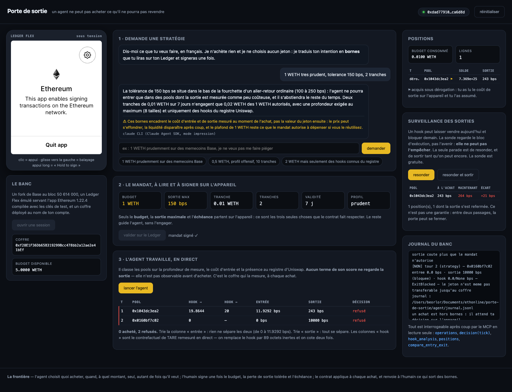
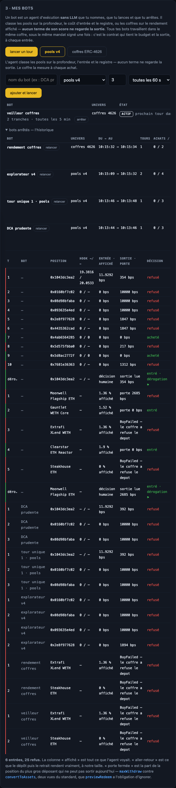
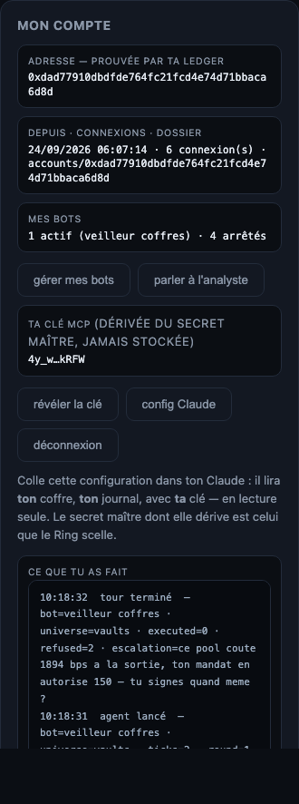
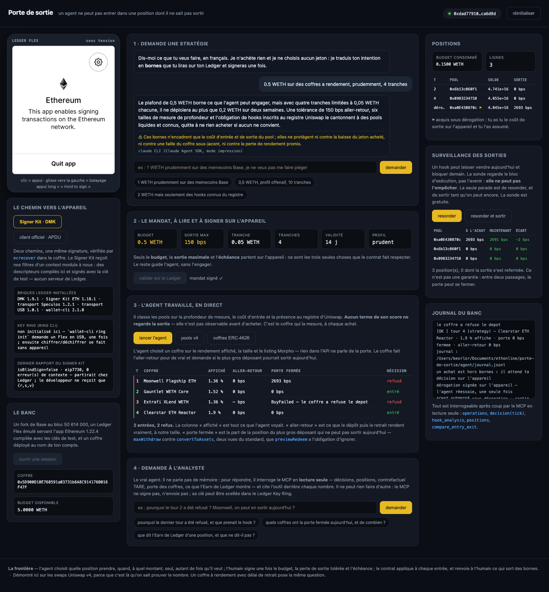
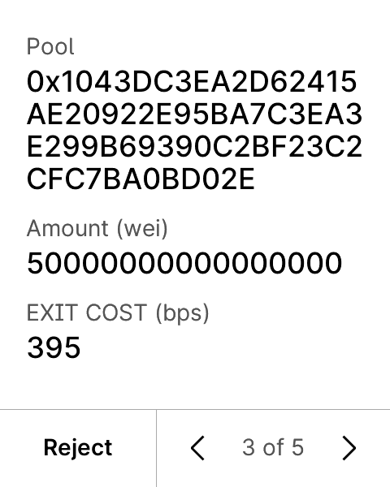
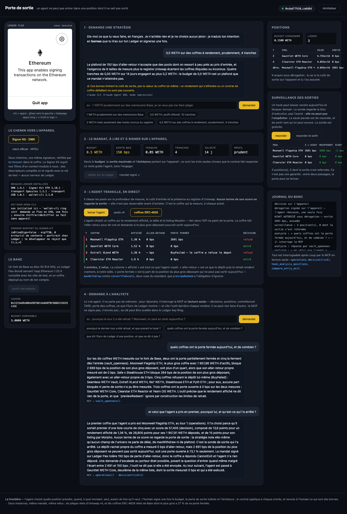

# PORTE DE SORTIE

> **Un agent ne peut pas entrer dans une position dont il ne sait pas sortir.**
>
> *Inside the mandate the agent acts on its own. It can never enter a position it cannot exit —
> the vault checks the way out in the same transaction. Anything else comes back to the Flex.*

Tout le monde borne ce qu'un agent **engage** : un plafond par jour, une liste de contrats, un
glissement maximal. Personne ne vérifie ce qu'il pourra **récupérer**. Ça vaut pour un jeton qu'un hook
empêche de revendre, pour un coffre à rendement dont on ne sort qu'après sept jours de file d'attente,
et pour toute position qu'on prend en une transaction et qu'on quitte en trois semaines — ou jamais.

**L'instance démontrée ici est le swap Uniswap v4**, parce que c'est là qu'on sait prouver le nombre :
un Ledger Flex émulé, un mandat lu et signé **sur l'appareil**, et un coffre qui refuse d'entrer là
d'où on ne sort pas — sur un fork de Base épinglé au bloc **50 614 000**. Les coffres ERC-4626 sont la
**seconde instance, construite** : dix coffres WETH réels de Base (Morpho), sous le même mandat, avec le
même refus. Le standard y écrit le piège lui-même — `previewRedeem` doit ignorer les limites de retrait —
et au bloc des mesures le plus gros coffre WETH de Base a **27 % de la position de son plus gros
déposant bloquée**, pendant que cinq coffres sur dix refusent même le dépôt. Détail plus bas.

```bash
./scripts/demo.sh
```

---

## Le problème

Tu confies un budget à un agent. Tu l'as bordé : plafond, contrats autorisés, glissement maximal. Il
respecte tout — et il peut quand même prendre une position **dont il ne sortira jamais**.

Sur Uniswap v4, le *hook* d'un pool décide qui a le droit de vendre. Les 16 et 17 septembre 2026, le
registre officiel des hooks Uniswap a fusionné trois hooks dont son propre robot écrit
*« HONEYPOT WARNING … enabling a rug/honeypot after users have already bought »* — et les a classés
`vanillaSwap: true`. Dans les 125 072 mesures de [TARE](../ETH_Online_2026), **six pools laissent entrer
pour 0 bps et prennent 9 990 à 9 999 bps à la sortie**.

- `amountOutMinimum` ne le voit pas : il borne **cet** achat, pas la revente, qui n'existe pas encore.
- Un plafond de dépense ne le voit pas : les fonds sont dépensés dans les règles.
- Transaction Check regarde le **jeton**, pas le **hook**.

**Tout le monde surveille l'entrée. Personne ne vérifie la sortie.** Et ce n'est pas propre aux
memecoins : un délai de retrait, une file d'attente, un plafond de sortie journalier ou un verrou
posent la même question, sur des marchés bien plus grands.

## Le mécanisme

1. **Le porteur signe un mandat, une fois, sur son Ledger** — lisible champ par champ :
   `Budget : 1 WETH · Max round-trip loss (bps) : 300 · Expires : …`
2. **`ExitVault` garde la règle.** L'agent n'a jamais les fonds : il appelle le coffre.
3. **À chaque achat, le coffre simule la revente intégrale dans la même transaction.** Si la sortie
   coûte plus que le mandat n'autorise — ou si le hook refuse la vente — la transaction est annulée
   avant d'exister.

La simulation est gratuite et n'écrit rien : c'est le motif du `V4Quoter` d'Uniswap
(`try poolManager.unlock(...) {} catch`, le callback revert avec son résultat). Elle revend **la
totalité** de ce qui vient d'être acheté : un piège à seuil de taille ne passe pas au travers.

## Le banc, dans le navigateur

```bash
python3 web/server.py     #  ->  http://127.0.0.1:8099
```



Cinq gestes, dans l'ordre :

0. **Connecte-toi avec ta Ledger.** Un compte, c'est une adresse **prouvée par l'appareil** : Sign-In with
   Ethereum signé dans ton navigateur (Signer Kit + WebHID, ou l'émulateur en banc), ou l'adresse lue sur
   l'appareil du banc. Tout ce qui t'appartient vit sous `accounts/<adresse>/` — profil, mandat, journal,
   notifications, et **ce que tu as fait** (`events.jsonl`). La carte **mon compte** montre ta **clé MCP**,
   dérivée du secret maître (`HMAC(maître, adresse)`, jamais stockée) et la configuration à coller dans ton
   Claude pour lire *ton* coffre, en lecture seule ; ses bots (actifs, arrêtés) et deux raccourcis : **gérer mes
   bots**, **parler à l'analyste** — l'analyste de ton compte, branché avec ta clé sur tes bots, tes décisions,
   tes positions. Le lien **schéma** ouvre `/schema.html` : qui fait quoi.
1. **Ouvre une session.** Un fork de Base au bloc 50 614 000, un Ledger Flex émulé servant l'app
   Ethereum 1.22.4 compilée avec les clés de test, et un coffre déployé **au nom de ton compte** —
   l'adresse prouvée à l'étape 0, pas un compte inventé.
2. **Demande une stratégie, en français.** Le CLI `claude` traduit ton intention en **bornes** :
   budget, coût de sortie toléré, taille de tranche, échéance. Il n'achète rien, ne choisit aucun
   jeton, et il écrit lui-même ce que ses bornes **ne** protègent **pas**.
3. **Valide sur le Ledger.** L'écran du Flex est à gauche, en direct, et **c'est toi qui l'approuves** :
   clic = appui, glissement vers la gauche = balayage, appui long = « Hold to sign ».
4. **Lance tes bots.** Un bot est un agent d'exécution sans LLM que tu nommes, que tu lances et que tu
   arrêtes : son univers (pools v4 ou coffres ERC-4626), ses tranches par tour, son rythme (un seul tour,
   ou toutes les 30 s, 60 s, 5 min). Tous tes bots travaillent dans le même coffre, sous le même mandat —
   le budget et la sortie sont tenus par le contrat, pas par eux. La carte **mes bots** montre ceux qui
   tournent (tours, achats/refus, dérogations, positions, dépensé, prochain tour), et **l'historique des
   bots arrêtés** avec leur bilan et leur motif de fin. Chaque ligne du journal porte le nom du bot ;
   quand un achat sort des bornes, la carte de dérogation le nomme : *« bot « DCA prudente » — ce pool
   coûte 387 bps à la sortie, ton mandat en autorise 150 — tu signes quand même ? »*





## L'agent, et pourquoi il se fait piéger

```bash
python3 agent/agent.py --ticks 6            # la stratégie choisit seule
python3 agent/agent.py --inject 0xbbe6      # une consigne injectée impose un jeton
```

La stratégie est ordinaire et défendable — c'est tout l'intérêt. Elle fait du DCA sur la longue traîne
de Base et classe les pools sur **la profondeur de mesure**, **le faible coût d'entrée** et **la présence
au registre de hooks d'Uniswap**. Aucun terme ne regarde la sortie : elle n'est pas observable avant
d'acheter.

### Ce que le hook prend vraiment — le contrefactuel de TARE, en direct

À chaque tour, on **remesure** : `anvil_setCode` remplace le hook par **89 octets inertes**, la
`PoolKey` est intacte donc le pool est identique, on cote deux fois, et l'écart est ce que le hook a
pris. Avec les mêmes gardes que TARE — relecture après écriture, sinon un `setCode` raté ferait
recoter le vrai hook et sortirait « 0 bps », la panne déguisée en mesure.

```
hook 0x963e91a451   entrant  19,96 bps   sortant     20 bps   -> sain, symetrique
hook 0x9ce0e33e68   entrant   0,00 bps   sortant  9 990 bps   -> le meme hook, cent fois plus cher a la sortie
```

On lit aussi les **permissions du hook dans les bits de sa propre adresse** — gratuit, disponible
même pour un hook absent du registre. Verdict mesuré : **ça ne discrimine pas.**
`afterSwapReturnsDelta`, le pouvoir de prélever sur la sortie, est porté par **780 pools sains sur
932** — c'est comme ça que tout hook de launchpad prend ses frais.

Ce que le corpus dit, et qui fait la démonstration :

- les pools dont on ne ressort jamais coûtent **0,00 bps à l'achat** — exactement comme 77 pools
  parfaitement sains ;
- leurs six hooks sont **absents du registre Uniswap** : ni nom, ni drapeau, ni audit ;
- donc **aucun signal disponible avant l'achat ne les distingue**.

Six tours, sortie réelle :

| tour | pool | entrée | sortie | décision |
|---|---|---|---|---|
| 1 | `0x1043dc3ea2` | 11,93 bps | 238 bps | **acheté** |
| 2 | `0x0160bf7c02` | 0,00 bps | 10 000 bps | refusé — le jeton n'est même pas transférable |
| 3 | `0x08d98bfaba` | 0,00 bps | 10 000 bps | refusé — idem |
| 4 | `0x093635e4ed` | 0,00 bps | 10 000 bps | refusé — idem |
| 5 | `0x2e8f977628` | 0,00 bps | 1 899 bps | refusé — `CannotExit` |
| 6 | `0x4435362cad` | 0,00 bps | 1 899 bps | refusé — `CannotExit` |

**Trie sur la colonne « entrée » : rien ne sépare acheté et refusé. Trie sur « sortie » : tout se sépare.**

Chaque tour écrit une ligne dans `agent/journal.jsonl` : l'univers, la liste courte avec toutes les
caractéristiques, le score et son détail, le choix, le pourquoi, la sonde, la décision du coffre, le motif.

## La seconde instance — dix coffres ERC-4626 réels, même mandat, même refus

Un coffre à rendement, c'est le standard ERC-4626 : tu déposes, tu reçois des parts, tu les rends plus
tard. **Et le standard écrit le piège lui-même** : `previewRedeem` *doit* ignorer les limites de retrait,
pendant que `maxWithdraw` peut valoir moins que la position — marché de prêt utilisé à 100 %, file
d'attente, cooldown, pause. Le rendement s'affiche, la porte est fermée.

La sonde ([`ExitVault.sol`](contracts/src/ExitVault.sol), `vaultExitLossBps`) fait deux choses, toutes
deux annulées par `revert` :

1. **l'aller-retour réel à notre taille** — `deposit` → `redeem` → mesure : ce que ça rend *vraiment*,
   pas ce que `previewRedeem` promet ;
2. **la porte** — la part de la position du **plus gros déposant** qui ne peut pas sortir aujourd'hui,
   `maxWithdraw(ref)` contre `convertToAssets(balanceOf(ref))`. Notre propre dépôt est toujours retirable
   à l'instant où on le fait (il apporte de la liquidité) ; la question honnête est : celui qui a le plus à
   sortir, peut-il sortir ?

Le pire des deux, en bps, passe par le **même champ du même mandat** (`maxRoundTripLossBps`) et le même
refus (`CannotExit`). Mesuré au bloc 50 614 000 sur les dix plus gros coffres WETH de Base (Morpho, adresses
et déposants via leur API, vérifiés sur le fork — [`Vault4626.t.sol`](contracts/test/Vault4626.t.sol)) :

| coffre | affiché | aller-retour 0,01 WETH | porte fermée | mandat à 300 bps |
|---|---|---|---|---|
| **Moonwell Flagship ETH** — 1 957 WETH, le plus gros | 1,36 % | 0 bps | **2 693 bps** (522,6 WETH de position, 381,8 retirables) | **refusé** |
| Safe × Steakhouse ETH | 1,37 % | 0 bps | 264 bps | accepté (refusé à 200) |
| Gauntlet WETH Core · Clearstar · Yearn OG | 1,5–1,9 % | 0 bps | 0 bps | accepté |
| Seamless · Extrafi · Re7 · Steakhouse · Pyth | — | **dépôt refusé** par le coffre : `AllCapsReached`, il est plein | — | — |

Et `previewRedeem` sur la position du plus gros déposant de Moonwell : **522,57 WETH** — pendant que
`maxWithdraw` dit **381,82**. Le mensonge est dans le standard, pas dans le coffre.

L'agent de rendement ([`agent/vaults.py`](agent/vaults.py)) choisit sur ce que l'API affiche — rendement,
taille, listing — et **prend Moonwell en premier**. Le coffre refuse ; la dérogation (`enterVaultUnderException`)
porte le nombre lu sur l'appareil, `EXIT COST (bps) · 2693`, à usage unique ; la sortie (`exitVault`) rend
9 999 999 999 999 999 wei sur 10¹⁶. La surveillance ([`agent/watch.py`](agent/watch.py)) resonde les deux
portes — la nôtre et celle du plus gros déposant — parce qu'un coffre ouvert à l'entrée se ferme quand les
emprunteurs prennent la liquidité : *après*, jamais *avant*. Observé dans le banc : **2 693 bps à l'entrée,
2 691 après notre dépôt** — nos 0,05 WETH ont entrouvert la porte de deux points.



## L'escalade — « hors bornes ne veut pas dire non »

C'est la seconde moitié du modèle de Ledger : *« si un agent tente une action hors de ces bornes,
elle est automatiquement renvoyée à l'humain pour approbation »*. Le coffre ne se contente donc pas
de refuser : il prépare une question.

Le porteur lit sur son Flex, en clair :



et signe — ou non — une **dérogation à usage unique**, liée à ce pool, ce montant, et **au nombre
qu'il vient de lire**. Six tests couvrent ce qu'elle ne permet pas :

```
test_1  refusé par le mandat, puis autorisé par la dérogation
test_2  une dérogation ne sert qu'une fois
test_3  la sortie a empiré depuis l'écran -> la dérogation ne vaut plus
test_4  une dérogation pour un pool ne vaut pas pour un autre
test_5  une dérogation n'est pas un blanc-seing : le budget s'applique toujours
test_6  une dérogation signée par quelqu'un d'autre ne vaut rien
```

Et une sortie **bloquée** (jeton non transférable, 10 000 bps) n'est jamais négociable : aucune
dérogation ne rend un jeton transférable, donc la question n'est même pas posée.

## Plusieurs agents

Le coffre l'est déjà, sans une ligne de plus : un mandat = un agent = un budget = un seuil. Cinq
tests le montrent — budgets séparés, pas d'emprunt de mandat, seuil de sortie par agent, révocation
à la pièce depuis l'appareil. **La limite, dite franchement :** les budgets sont séparés, *la
trésorerie ne l'est pas*. Si un agent vide le coffre, l'autre est dans son mandat mais sans fonds.
Pour isoler les fonds, il faut un coffre par agent.

## Le MCP — lecture seule, pour analyser après coup

Il ne lance rien, ne signe rien, n'envoie aucune transaction. Il sert **les données qui ont mené aux
décisions**, pour les analyser avec Claude.

```bash
python3 mcp/pds_mcp.py --print-key      # la clé, créée au premier appel
python3 mcp/pds_mcp.py --selftest       # les six outils, à vide
```

```json
{ "mcpServers": { "porte-de-sortie": {
    "command": "python3",
    "args": ["/chemin/porte-de-sortie/mcp/pds_mcp.py"],
    "env": { "PDS_MCP_KEY": "<la clé>" } } } }
```

| outil | ce qu'il rend |
|---|---|
| `operations` | les opérations tentées, l'issue et son motif |
| `decision(tick)` | **tout** ce qui a mené à une décision : univers, liste courte, scores et leur détail, sonde, mandat, issue |
| `positions` | ce que le coffre détient, le budget consommé, ce qui reste |
| `mandate` | le mandat signé sur le Ledger et ce qu'il autorise |
| `universe_facts` | pourquoi un piège est indiscernable avant l'achat, chiffres à l'appui |
| `compare_entry_exit` | entrée contre sortie, opération par opération |
| `hook_analysis` | ce que chaque hook prend, **remesuré en direct** par le contrefactuel de TARE, dans les deux sens |

Le banc écoute sur le port **8099** (`PORT=… python3 web/server.py` pour en changer) : 8080 est trop
souvent pris par un conteneur qui traîne, et une démo qui tombe sur la page de quelqu'un d'autre n'est
pas une démo.

Chaque appel exige la clé. Sans elle : `clé refusée`.

## L'analyste — le vrai agent

Les agents de swaps et de rendement sont la **démonstration de l'outil** : des stratégies ordinaires qui se
font piéger, pour montrer que le coffre les rattrape. **Le vrai agent, c'est l'analyste**
([`agent/analyst.py`](agent/analyst.py)) : un modèle (Claude, par le CLI `claude` — le Claude Agent SDK)
qui, pour répondre, **interroge nos outils** au lieu de parler de mémoire. Il n'a accès qu'au MCP en
lecture seule (`--strict-mcp-config`, rien d'autre n'est chargé) et cite l'outil derrière chaque nombre.

```
$ python3 agent/analyst.py "pourquoi le tour 2 a-t-il ete refuse, et que prenait son hook ?"

Le tour 2 a été refusé par le coffre (`decision`, « REFUSED_BY_VAULT ») : la sonde a simulé un achat
puis une revente intégrale, et la revente a échoué (0x90bfb865), d'où 10 000 bps et le motif « ExitBlocked ».
La stratégie avait choisi ce pool (hook RwagmiHookV2, score 97,0) parce qu'il mesurait bien sur 8 tailles,
entrait à 0,0 bps et figurait au registre ; aucun terme du score ne regarde la sortie. Côté hook, le
contrefactuel TARE (`hook_analysis`) donne 0,00 bps à l'entrée ; à la sortie la mesure est NOT_MEASURABLE :
la cotation avec le hook a reverté. […] La vérité terrain note toutefois `is_one_way_trap: false`.

— outils consultés : decision(tick=2), hook_analysis(tick=2)          (30 s)
```

Trois garanties, par construction : il ne peut **rien faire** (le MCP ne signe pas, n'envoie pas, ne lance
rien) ; il n'a **que nos outils** ; la clé qui ouvre le MCP peut être **scellée dans le Ledger Key Ring**.
C'est la brique « Agent Stack » du brief faite pour de vrai : leur `wallet-cli` lu (`ledger_earn_yields`),
leur format de skills adopté ([`SKILL.md`](SKILL.md)), et un agent qui raisonne sur des données mesurées.
Dans le banc : carte « 4 · demande à l'analyste » — **une conversation** (l'historique lui est redonné à chaque
tour, « et celui d'avant ? » marche), et sous chaque réponse **la trace des appels MCP**, outil et arguments,
comme dans un client MCP. Il ne peut rien faire d'autre que lire : c'est la garantie, et elle est visible.



## Ce que la démo en ligne de commande montre, dans l'ordre

| | |
|---|---|
| **0** | le coffre naîtra à une adresse connue d'avance — c'est le `verifyingContract` que l'appareil verra |
| **1** | un Ledger **Flex** émulé (Speculos) sert l'app Ethereum 1.22.4 compilée avec les clés de test |
| **2** | le porteur lit et **signe le mandat sur l'appareil**, avec **nos** filtres EIP-712 — sans `originToken`, sans partenariat, **aucun serveur Ledger contacté** |
| **3** | sur le fork : l'agent achète seul un pool sain (sortie 198 bps, accepté) ; il lit une page piégée et vise un pool one-way (sortie 9 990 bps) → **refus**, budget inchangé |

Sortie réelle du dernier passage :

```
=== 1. Le mandat vient du Ledger ===
   porteur (signature verifiee sur la chaine) : 0xDad77910DbDFdE764fC21FCD4E74D71bBACA6D8D
   agent autorise                             : 0x70997970C51812dc3A010C7d01b50e0d17dc79C8
   perte aller-retour maximale                : 300 bps

=== 2. L'agent achete seul, dans le mandat ===
   pool sain  : ACHAT ACCEPTE, 895071256029443945504 jetons recus, sortie 198 bps

=== 3. Injection : une page piegee dit a l'agent d'acheter ce jeton ===
   la sonde regarde la sortie : 9990 bps (revente refusee : false)
   pool piege : ACHAT REFUSE - on n'entre pas la d'ou on ne sort pas

=== 4. Rien n'a bouge ===
   budget consomme : 100000000000000 wei (inchange). Le Flex n'a pas clignote.
```

Et sur l'écran de l'appareil (`captures/mandat-02.png`) : **`Budget · 1 WETH`**,
**`Max round-trip loss (bps) · 300`**, **`Expires · 2026-09-28`**.

## La frontière agent / humain

> **L'agent** choisit quelle position prendre, quand, à quel montant — seul, autant de fois qu'il
> veut, dans le mandat.
> **L'humain** signe une fois, sur le Flex : le budget, la perte aller-retour tolérée, l'échéance.
> **Le contrat** applique à chaque achat. L'agent ne peut ni relever le seuil, ni changer la règle, ni
> toucher à la clé : pour ça, il faut revenir à l'appareil.

## Les briques Ledger du brief, ligne à ligne

Le brief dit : *« built with Ledger's Agent Stack and/or Ring CLI, and/or by wiring in a Signer for
human-in-the-loop approval »*. Les trois sont là, et chacune fait quelque chose de réel — pas une
mention dans un README.

| le brief dit | ce qui tourne ici | ce que ça prouve |
|---|---|---|
| **a Signer** | `@ledgerhq/device-signer-kit-ethereum` **1.18.1** sur le DMK **1.9.1**, transport Speculos 1.2.1 ou USB (node-hid 1.0.1) — [`ledger/dmk/sign_typed_data.cjs`](ledger/dmk/sign_typed_data.cjs). Le kit reçoit nos filtres d'un **context module à nous**, qui sert des descripteurs compilés et signés localement ([`ledger/compile_descriptor.py`](ledger/compile_descriptor.py), clé de test `cal.pem`). Aucun serveur de Ledger. | L'écran : `Contract · Exit mandate`, `Network · Base`, `Budget · 0.2 WETH`, `Max round-trip loss (bps) · 150`, `Expires · …`, `Hold to sign`. Le rapport du kit : `isBlindSign=false · eip7730 · 0 erreur`. La signature vérifiée par `ecrecover` dans le coffre (`LedgerScene.t.sol`, vert). |
| **Agent Stack** | `@ledgerhq/wallet-cli` **2.1.0** en lecture ([`ledger/walletcli.py`](ledger/walletcli.py)) ; l'outil MCP `ledger_earn_yields` ; [`SKILL.md`](SKILL.md) et [`AGENTS.md`](AGENTS.md) au format de leurs skills. Le modèle qui propose est le Claude Agent SDK (`claude -p`). | `wallet-cli earn yields` rend fournisseur, jeton, rendement, lien de dépôt — et **aucun champ sur la sortie** (délai, `maxWithdraw`, coût). Le trou qu'on comble est écrit dans leur propre CLI. |
| **Ring CLI** | `wallet-cli ring` (Ledger Key Ring Protocol) scelle la clé du MCP : [`scripts/ring-seal.sh`](scripts/ring-seal.sh) ; le MCP la déchiffre au démarrage et dit d'où elle vient (`--key-status`). | La clé de lecture de l'agent adossée à la graine du porteur, révocable depuis l'appareil. **Honnêtement** : `ring init` exige un Flex en USB, une fois — pas Speculos ; on l'a câblé et testé jusqu'au message « not initialized », pas au-delà. |

Deux chemins vers l'appareil, une même signature : le Signer Kit (défaut) ou le client officiel
d'app-ethereum en APDU direct ([`ledger/signers.py`](ledger/signers.py), bouton dans le banc). Le second
est celui qui a trouvé le bug chainId ; le premier est celui que le brief nomme.

Et le même mandat **sans** nos descripteurs (`--blind`), comme le ferait une intégration ordinaire sans
`originToken` : l'appareil affiche *« This transaction cannot be clear-signed. Enable blind signing in
the settings »* et refuse (`0x6a80`) ; le kit rapporte `isBlindSign=true · device_rejected_context` —
à Ledger, pas au développeur, qui ne reçoit que l'erreur. L'appareil est strict. La pile est muette.
C'est le point 1 de [`FEEDBACK.md`](FEEDBACK.md), mesuré.

## Ce que ça n'attrape pas — dit avant qu'on nous le demande

- **L'interrupteur basculé après l'achat — ça ne se corrige pas, ça se surveille.** Un hook peut
  laisser vendre aujourd'hui et bloquer demain (`erase(address)`, `tokenSet(token)` sans contrôle
  d'accès). La sonde regarde le bloc d'exécution, pas l'avenir : **elle ne peut pas l'empêcher.** La
  seule parade réelle est de **resonder les positions et sortir tant qu'on peut encore** — la sonde
  est gratuite, on la relance aussi souvent qu'on veut :

  ```bash
  python3 agent/watch.py                 # un passage, rapport
  python3 agent/watch.py --sell-if 500   # vend ce qui a empiré au-delà de 500 bps
  ```
  ```
  0x1043dc3ea2  sortie a l'achat 387 bps  ->  maintenant 960 bps  (+573 bps)   [VENDU]
  ```

  **Ce n'est pas une garantie : entre deux passages, la porte peut se fermer.** C'est une réduction de
  fenêtre, et on ne la vend pas pour autre chose.
- **Le prix.** Le mandat borne le **coût de sortie**, pas la valeur du jeton. Un agent peut acheter
  quelque chose de liquide et de mauvais.
- **La sonde de détention borne son gaz à 400 000, soit ×11 la mesure.** Un `take()` sur un jeton sain
  coûte **35 377 gaz** (mesuré sur quatre témoins, `test/GasProbe.t.sol`). La borne existe parce qu'un
  jeton piégé peut brûler **tout** le gaz qu'on lui donne en revertant : sans elle, un test passait de
  3,3 M à 1 073 M de gaz. Un jeton dont le transfert coûterait plus de 400 000 serait classé « non
  détenable » à tort — c'est un faux négatif, à ×11 de la mesure, et on préfère refuser à tort
  qu'accepter à tort.
- **La démo tourne sur un fork**, avec un Ledger émulé. Sur un Flex physique, l'app de série affiche
  déjà le mandat champ par champ (valeurs brutes) ; l'app compilée avec les clés de test, chargée par
  `ledgerctl`, l'affiche formaté comme ici.

